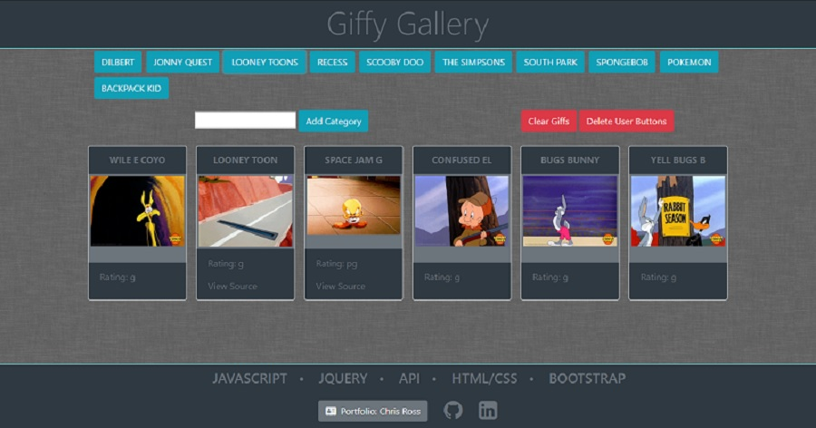

<h1><em>Giffy-Gallery</em></h1>

Visit online at:
https://vtchris.github.io/Giffy-Gallery/

<h2>Technology</h2>
<ul>
  <li>AJAX</li>
  <li>JavaScript</li>
  <li>jQuery</li>
  <li>Bootstrap</li>
  <li>HTML/CSS</li>
</ul> 

<h2>Mission (Homework)</h2> 
# GifTastic

### Overview

In this assignment, you'll use the GIPHY API to make a dynamic web page that populates with gifs of your choice. To finish this task, you must call the GIPHY API and use JavaScript and jQuery to change the HTML of your site.

### Instructions

1. Before you can make any part of your site work, you need to create an array of strings, each one related to a topic that interests you. Save it to a variable called `topics`.
   * We chose animals for our theme, but you can make a list to your own liking.

2. Your app should take the topics in this array and create buttons in your HTML.
   * Try using a loop that appends a button for each string in the array.

3. When the user clicks on a button, the page should grab 10 static, non-animated gif images from the GIPHY API and place them on the page.

4. When the user clicks one of the still GIPHY images, the gif should animate. If the user clicks the gif again, it should stop playing.

5. Under every gif, display its rating (PG, G, so on).
   * This data is provided by the GIPHY API.
   * Only once you get images displaying with button presses should you move on to the next step.

6. Add a form to your page that takes a value from a user input box and adds it to your `topics` array. Then make a function call that takes each topic in the array and remakes the buttons on the page.

7. Deploy your assignment to Github Pages.

### Bonus Goals

1. Ensure your app is fully mobile responsive.

2. Allow users to request additional gifs to be added to the page.
   * Each request should ADD 10 gifs to the page, NOT overwrite the existing gifs.

3. List additional metadata (title, tags, etc) for each gif in a clean and readable format.

4. Integrate this search with additional APIs such as OMDB, or Bands in Town. Be creative and build something you are proud to showcase in your portfolio

5. Allow users to add their favorite gifs to a `favorites` section.
   * This should persist even when they select or add a new topic.
   * If you are looking for a major challenge, look into making this section persist even when the page is reloaded(via localStorage or cookies).
